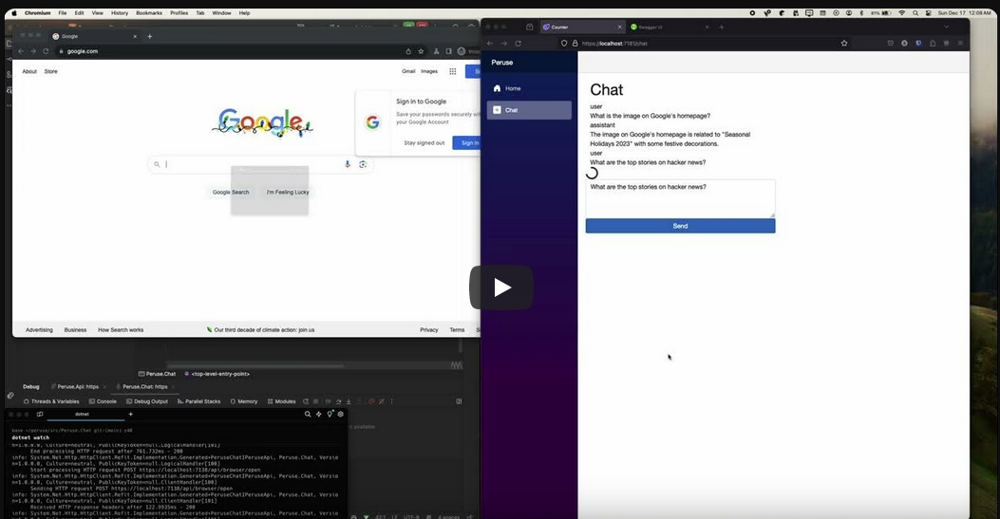

# Peruse
A REST API wrapper around the [Playwright](https://playwright.dev/) browser automation library to allow AI agents to peruse websites and interact with them using a real browser.

View it in action:

## NOTE: This project is still in the early stages of development and is not yet ready for production use.
You can go ahead and use it but be aware that:
- There is NO SECURITY setup yet so anyone can access your API
- It may crash or not work as expected

## Repository Structure
- `peruse/Peruse.Api` - The REST API
  - `Program.cs` - Using the minimal ASP.NET Core setup so endpoints are defined here.
  - `Wttw` - Browser commands and libraries that handle those commands (that way Playwright is not the only library that can be used). Also, if you're from the Chicago area you'll get the reference.
    - `Commands` - Commands used by the API to interact with the browser.
    - `Responses` - Responses returned by the Commands.
    - `PlaywrightWindow` - Playwright command handlers.
- `src/Peruse.Chat` - Blazor Web App to Chat with OpenAI
  - `ChatFeature` - Directory containing code to manage calling OpenAI and Peruse API
  - `Components/Pages/Chat.razor` - The web page with the chat message box for the user to talk to OpenAI

## Getting Started
If this is your first time using Playwright, you'll need to install the browser drivers for the browsers you want to use. Visit the [Playwright documentation](https://playwright.dev/dotnet/docs/intro) for more information.

Once the browers are installed, ensure the `OPEN_AI_KEY` environment variable is set for the `Peruse.Chat` project, either through a global env variable or using `dotnet user-secrets`.

Start up the API and Chat projects and you should be good to go. 

